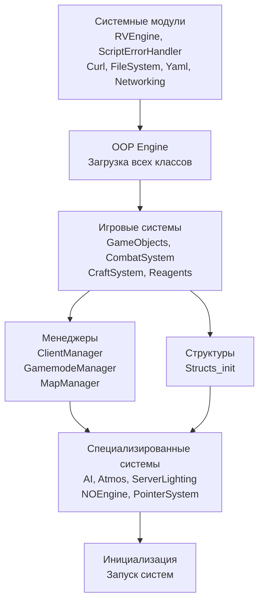
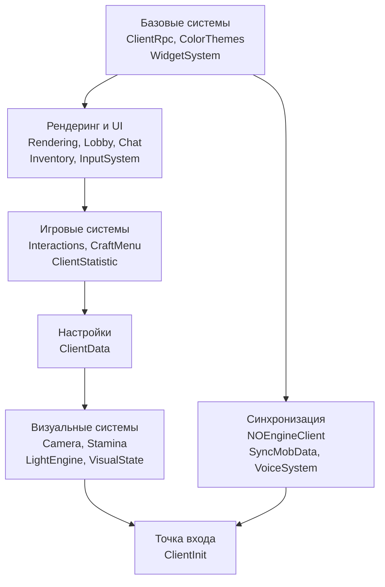

# Структура проекта

## Обзор

Проект организован как модульная система с четким разделением на серверную (host), клиентскую (client) части, часть редактора (Editor) и общие компоненты.

## Корневая структура

```
ReSDK_A3/
├── Src/                    # Исходный код проекта
├── Documentation/          # Документация
├── RBuilder/              # Система сборки и деплоя
├── Resources/             # Ресурсы (звуки, текстуры, UI)
├── Third-party/           # Сторонние компоненты
└── config.cpp             # Конфигурация миссии Платформы
```

## Директория Src/

Основная директория с исходным кодом:

```
Src/
├── host/                  # Серверный код (выполняется на сервере)
├── client/                # Клиентский код (выполняется на клиенте)
├── Editor/                # Код редактора ReEditor
├── RVEngine/              # C++ расширение (внешний компонент)
├── ReBridge/              # Редакторный модуль для C# скриптов (только для редактора)
├── Scripts/               # C# скрипты для инструментов редактора
├── config.cpp             # Конфигурация SQF кода для Платформы
├── SETTINGS.h             # Флаги компиляции и настройки
├── VERSION                # Версия проекта
├── fn_init.sqf            # Инициализация функции препроцессора
├── public_loader.sqf      # Публичный загрузчик клиентского кода
└── M2C.sqf                # База данных соответствий конфигов классов Платформы и их 3D моделей (автогенерируемый)
```

### Ключевые файлы

#### host/init.sqf
**Назначение:** Главная точка входа серверного кода

**Что делает:**
- Загружает RVEngine (если используется)
- Инициализирует системные модули (ScriptErrorHandler, Curl, FileSystem, Yaml)
- Загружает OOP engine и все классы
- Инициализирует игровые системы (GameObjects, CombatSystem, AI, etc.)
- Устанавливает состояние загрузки сервера

**Важно:** Порядок загрузки модулей критичен из-за зависимостей.

#### client/Init.sqf
**Назначение:** Главная точка входа клиентского кода

**Что делает:**
- Инициализирует базовые системы (CBA функции)
- Проверяет версию и совместимость
- Подготавливает загрузчик клиентских модулей

#### client/loader.hpp
**Назначение:** Загрузчик клиентских модулей

**Что делает:**
- Использует макрос `importClient()` для загрузки модулей
- Макрос сразу вызывает модули в порядке определения (если `_canCallClientCode` истинно)
- Создает массив `allClientContents` с функциями инициализации для последующего использования
- Определяет порядок загрузки модулей (важно для зависимостей)

#### Editor/Editor_init.sqf
**Назначение:** Главная точка входа редактора

**Что делает:**
- Инициализирует компоненты редактора через `componentInit()`
- Настраивает систему отладки

#### M2C.sqf
**Назначение:** База данных соответствий между конфигами классов Платформы и их 3D моделями

**Для чего создавался:** Оптимизация сетевого трафика. Когда NOEngine отправляет пакет на создание объекта клиенту, вместо передачи длинного пути к модели отправляется короткий числовой ID, что значительно снижает объем передаваемых данных.

**Где используется:**
- NOEngine - для передачи моделей объектов по сети (сервер → клиент)
- Модули работы с игровыми объектами - для преобразования между классами конфигов и путями к моделям
- Редактор - для работы с моделями и их поиска

**Генерация файла:**
- Файл генерируется **вручную** через инструмент `GenerateModelData` в редакторе ReEditor
- **Как вызвать:** В редакторе ReEditor откройте меню инструментов и выберите `Генерировать карту моделей`
- **Когда нужно перегенерировать:**
  - При добавлении новых моделей в проект
  - При изменении путей к существующим моделям
  - При обновлении конфигов классов Платформы, связанных с моделями

**Последствия отсутствия файла:**
- **Для редактора:** Файл критичен - редактор не сможет работать с моделями и их поиском (переменная `core_model2cfg` не будет инициализирована)
- **Для сервера/клиента:** Файл критичен - проект не будет работать без него
  - Переменные `core_cfg2model`, `core_assoc_model2id`, `core_assoc_id2model`, `core_modelBBX` используются в множестве мест:
    - `Item.sqf` - для получения путей к моделям предметов
    - `DynamicMapLoader.sqf` - для загрузки моделей объектов на карте
    - `NOEngine_ObjectRegisterModel.sqf` - для оптимизации сетевого трафика (преобразование путей в числовые ID)
    - `NOEngineClient_TransportLevel.sqf` - для преобразования числовых ID обратно в пути
    - `Gurps.sqf` - для работы с размерами объектов
    - `RProx.sqf` - для работы с прокси-объектами
  - Без файла эти переменные не будут инициализированы, что приведет к ошибкам при попытке их использования

**Важно:** Файл не редактируется вручную - только через инструмент генерации в редакторе.

#### SETTINGS.h
**Назначение:** Центральный файл настроек компиляции

**Содержит:**
- Флаги компиляции (`DEBUG`, `RELEASE`, `EDITOR`, `RBUILDER`)
- Настройки путей к ресурсам
- Конфигурацию отладки и логирования
- Настройки сетевого взаимодействия

**Важно:** Изменения в этом файле влияют на всю сборку проекта.

## Серверные модули (host/)

Все модули в `host/` выполняются только на сервере. Ниже перечислены основные модули, сгруппированные по назначению:

### Системные модули (низкоуровневые API)

Эти модули являются основой системы и требуют особого внимания при изменениях:

- **`OOP_engine/`** - Ядро объектно-ориентированной системы. Реализует полный цикл работы с классами: парсинг определений классов (через макросы из `oop.hpp`), обработку наследования, компиляцию классов в исполняемый код и создание экземпляров. Содержит систему атрибутов для модификации классов на этапе компиляции, функции рефлексии для работы с типами и их иерархией, механизм перезагрузки модулей в рантайме. Управляет жизненным циклом объектов (конструкторы/деструкторы), отслеживает количество созданных объектов и предоставляет инструменты для работы с размерами объектов в памяти
- **`Networking/`** - Низкоуровневая система сетевых взаимодействий с клиентами. Предоставляет функции для быстрой синхронизации переменных между сервером и клиентами через `missionNamespace setVariable` с указанием владельца. Поддерживает отправку данных конкретным клиентам или массиву объектов, определяя их владельцев автоматически. Включает опциональную симуляцию задержки сети для тестирования. Используется для синхронизации статистики и других данных, которые не требуют гарантированной доставки
- **`NOEngine/`** - Система репликации игровых объектов (Net Objects Engine). Реализует оптимизированную загрузку и синхронизацию игровых объектов через систему чанков (chunks). Разделяет карту на чанки разных типов (Item, IStruct, Decor) с разными размерами и дистанциями загрузки. Отслеживает позицию игроков и динамически загружает/выгружает чанки в области видимости. Управляет жизненным циклом объектов на клиенте (создание, обновление, удаление), оптимизирует сетевой трафик через использование числовых ID моделей вместо полных путей. Поддерживает систему временных меток для инкрементальных обновлений при возвращении клиента в измененный чанк
- **`PointerSystem/`** - Система указателей для работы с OOP объектами по сети. Создает и хранит ассоциативный словарь, который связывает строковый уникальный ID (указатель) объекта с его ссылкой. Это необходимо, так как OOP объекты не передаются по сети напрямую (как и модели). Позволяет клиенту отправлять запросы на взаимодействие с объектами по их ID, а серверу находить соответствующий объект по этому ID
- **`ScriptErrorHandler/`** - Обработка ошибок выполнения

### Игровые системы

- **`GameObjects/`** - Библиотека игровых объектов (Item, IStruct, Decor, BasicMob). Содержит множество различных систем и механики для работы с игровыми объектами.
- **`CombatSystem/`** - Боевая система (урон, броня, боевые взаимодействия)
- **`CraftSystem/`** - Система создания предметов из ингредиентов и файлы рецептов крафта
- **`AI/`** - Искусственный интеллект для NPC и мобов, генерация навигационных графов и поиск пути
- **`ClientManager/`** - Управление подключенными клиентами и их состояниями

### Игровые механики

- **`GamemodeManager/`** - Менеджер игровых режимов и их переключение
- **`GameModes/`** - Реализации конкретных игровых режимов
- **`StatusEffects/`** - Статусные эффекты (болезни, баффы, дебаффы)
- **`Reagents/`** - Система химических реагентов и их взаимодействий
- **`Perks/`** - Система перков персонажей
- **`Traits/`** - Система черт персонажей
- **`GURPS/`** - Ролевая система на основе GURPS

### Утилиты и инструменты

- **`Logger/`** - Логирование в файл
- **`Database/`** - Взаимодействие с БД (SQLite)
- **`Yaml/`** - Работа с YAML файлами
- **`FileSystem/`** - Работа с файловой системой
- **`Curl/`** - HTTP запросы
- **`Tools/`** - Различные инструменты SDK (только для редактора\симуляции)

### Общие компоненты (host/CommonComponents/)

Модули в этой директории используются как на сервере, так и на клиенте. Они загружаются через `importCommon()` в `client/loader.hpp`.

**Что размещать в CommonComponents:**

- ✅ Общие структуры данных и утилиты для работы с ними
- ✅ Алгоритмы, не зависящие от окружения (host/client)
- ✅ Математические функции и утилиты
- ✅ Утилиты для работы с цветами (rgb,rgba,html)
- ✅ Общие константы и перечисления
- ✅ Функции, которые должны работать одинаково на клиенте и сервере

**Что НЕ размещать в CommonComponents:**

- ❌ Код, специфичный для сервера (используйте `host/`)
- ❌ Код, специфичный для клиента (используйте `client/`)
- ❌ Код, использующий OOP систему (она доступна только на сервере)
- ❌ Код с зависимостями от модулей, доступных только на сервере или только на клиенте

**Примеры правильного использования:**

```sqf
// ✅ Правильно - общая утилита для работы с цветами
// CommonComponents/Color.sqf
color_toArray = {
    params ["_color"];
    // работает одинаково на клиенте и сервере
    [_color select 0, _color select 1, _color select 2, _color select 3]
};

// ✅ Правильно - математическая функция
// CommonComponents/Algorithm.sqf
algorithm_calculateDistance = {
    params ["_pos1", "_pos2"];
    // работает одинаково везде
    _pos1 distance _pos2
};
```

**Примеры неправильного использования:**

```sqf
// ❌ Неправильно - попытка использовать OOP макросы (oop.hpp не доступен в CommonComponents)
// CommonComponents/MyModule.sqf
// ОШИБКА: CommonComponents не имеют доступа к oop.hpp, OOP система доступна только на сервере
myModule_process = {
    params ["_obj"];
    callFunc(_obj,doSomething); // ОШИБКА: макрос callFunc не определен!
    getVar(_obj,someField);     // ОШИБКА: макрос getVar не определен!
    setVar(_obj,someField,10);  // ОШИБКА: макрос setVar не определен!
};

// ❌ Неправильно - попытка объявить класс (OOP доступен только на сервере)
// CommonComponents/MyClass.sqf
class(MyClass) extends(BaseClass)  // ОШИБКА: макросы class, extends не определены!
    var(myField, 0);
endclass

// ❌ Неправильно - использует клиент-специфичные функции
// CommonComponents/MyModule.sqf
myModule_render = {
    // использует WidgetSystem, доступный только на клиенте
    // ОШИБКА: WidgetSystem не доступен на сервере!
};
```

**Важно:** CommonComponents выполняются и на сервере, и на клиенте, поэтому они не могут использовать код, специфичный для какого-то одного окружения. OOP система (`oop.hpp`) доступна только на сервере, поэтому все макросы из `oop.hpp` (например, `callFunc`, `getVar`, `setVar`, `class`, `extends`) не могут использоваться в CommonComponents.

**Загрузка CommonComponents:**

CommonComponents загружаются через `host/CommonComponents/loader.hpp` в `client/loader.hpp`:

```sqf
// В client/loader.hpp
importCommon("Color.sqf");      // Загружает host/CommonComponents/Color.sqf
importCommon("Algorithm.sqf");  // Загружает host/CommonComponents/Algorithm.sqf
```

**Структура CommonComponents:**

```
host/CommonComponents/
├── loader.hpp                  # Загрузчик общих компонентов
├── Color.sqf                   # Цветовые утилиты
├── Algorithm.sqf              # Алгоритмы
├── DateTime.sqf               # Работа с датой и временем
├── ModelsPath.sqf             # Пути к моделям
├── SoundEngine.sqf            # Звуковой движок
├── StructLib.sqf              # Библиотека структур
└── Structs/                   # Структуры данных
    ├── Allocator.sqf
    ├── Collections.sqf
    └── ...
```

**Важно:**
- CommonComponents должны быть полностью независимы от окружения (host/client)
- Не используйте функции, доступные только на сервере или только на клиенте
- Тестируйте код CommonComponents как на сервере, так и на клиенте

## Клиентские модули (client/)

Все модули в `client/` выполняются только на клиенте:

### Системные модули

- **`ClientInit/`** - Инициализация клиента и точка входа клиентского кода
- **`ClientData/`** - Системные данные клиента, настройки и конфигурация
- **`ClientRpc/`** - Клиентский RPC компонент (отправка запросов на сервер)
- **`ClientStatistic/`** - Отладочная статистика (FPS, использование памяти)

### UI и взаимодействие

- **`WidgetSystem/`** - Система виджетов для создания пользовательского интерфейса
- **`InputSystem/`** - Обработка пользовательского ввода (клавиатура, мышь)
- **`Interactions/`** - Система взаимодействия с объектами и персонажами
- **`Inventory/`** - Клиентская часть системы инвентаря
- **`Hud/`** - Игровой HUD (здоровье, индикаторы, информация)
- **`Lobby/`** - Интерфейс лобби игры
- **`CraftMenu/`** - Интерфейс меню крафта предметов

### Визуальные системы

- **`Rendering/`** - Управление визуальными параметрами через функции Платформы (постобработка, HDR, динамическая дальность прорисовки, декали)
- **`LightEngine/`** - Система динамического освещения объектов и локаций
- **`VisualState/`** - Управление визуальными состояниями объектов (скрытие, эффект призрака, броня, прикрепленные объекты)
- **`LocalEffects/`** - Локальные визуальные эффекты общего назначения
- **`BlastFx/`** - Кратковременные визуальные эффекты с автоочисткой (выстрелы, попадания, взрывы)

### Аудио и синхронизация

- **`SoundSystem/`** - Воспроизведение звуковых эффектов и музыки
- **`VoiceSystem/`** - Система голосового чата между игроками (ReVoice, используется в продакшене), также содержит новую аудиосистему с поддержкой эффектов (AudioSystem.sqf, активируется флагом ENABLE_NEW_AUDIO_SYSTEM)
- **`NOEngineClient/`** - Клиентская часть NOEngine (загрузка и синхронизация объектов)
- **`SyncMobData/`** - Синхронизация данных персонажей между сервером и клиентом (предметы в руках, лица, части тела, визуальные состояния, анимации)
- **`OneSync/`** - Оптимизированная клиентская синхронизация для снижения сетевого трафика (падение персонажа, звуки шагов, освещение)

### Дополнительные модули

- **`Chat/`** - Текстовый игровой чат
- **`ColorThemes/`** - Цветовые темы интерфейса
- **`DiscordRPC/`** - Интеграция с Discord (отображение статуса игры)
- **`ProxyItems/`** - Прокси-модели предметов для отображения на персонажах
- **`GeometryFixer/`** - Костыли для исправления проблем Платформы: защита от застревания в текстурах, прохождения сквозь стены, застревания в падении, проблемы с коллизией мобов
- **`StaminaControl/`** - UI для отображения выносливости персонажа (виджет стамины). Логика стамины управляется через переменные `cd_stamina_cur`/`cd_stamina_max`, модуль только визуализирует эти значения
- **`NetDisplays/`** - Шаблоны интерфейсов для взаимодействия игроков с игровыми объектами. Объекты, реализующие интерфейс `INetDisplay` (торговые консоли, генераторы, медицинские устройства и др.), могут открывать эти интерфейсы при взаимодействии с игроком. Примеры: MerchantConsole (торговля), PowerConsole (управление питанием), ChemicalBlender (химические реакции)

## Редакторные модули (Editor/)

Модули в `Editor/` используются только в редакторе ReEditor:

- **`Core/`** - Ядро редактора и базовые компоненты
- **`GameObjectsAssembly/`** - Инструменты сборки и конфигурации игровых объектов
- **`GameObjectsInspector/`** - Инспектор свойств игровых объектов
- **`GameObjectsLibrary/`** - Библиотека доступных игровых объектов
- **`GamemodesManager/`** - Управление игровыми режимами в редакторе
- **`MapsManager/`** - Управление картами и их загрузкой
- **`VisualComponents/`** - Визуальные компоненты интерфейса редактора
- **`VisualScripting/`** - Визуальное программирование через ReNode
- **`Widgets/`** - Виджеты пользовательского интерфейса редактора
- **`SystemTools/`** - Системные инструменты редактора (генерация данных, утилиты)

### ReBridge

**`ReBridge/`** - это редакторный модуль, реализующий мост между SQF и C#. Он используется исключительно в редакторе для выполнения C# скриптов, которые реализуют функции редактора (например, такие как работа с файловой системой).

**Особенности:**
- Используется только в контексте редактора
- Позволяет выполнять C# скрипты из SQF кода редактора
- Не участвует в игровом процессе (не загружается на сервере или клиенте)
- C# скрипты находятся в `Scripts/` и компилируются для использования в редакторе

### Scripts/

**`Scripts/`** содержит C# скрипты для инструментов редактора:
- Скрипты, используемые через ReBridge
- Вспомогательные инструменты для редактора
- Утилиты для разработки контента

## Заголовочные файлы (.hpp, .h)

**Различие между .h и .hpp:** См. [Стандарты кодирования - Использование заголовочных файлов](09_CODING_STANDARDS.md#использование-заголовочных-файлов-h-и-hpp)

### host/engine.hpp
**Назначение:** Фундаментальный заголовочный файл с базовыми макросами и утилитами для всего проекта

**Содержит:**

**Логирование и отладка:**
- `log()`, `logformat()` - информационное логирование
- `warning()`, `warningformat()` - предупреждения
- `error()`, `errorformat()` - ошибки
- `trace()`, `traceformat()` - детальная трассировка (только в DEBUG)
- `breakpoint()`, `breakpoint_setfile()` - логирование с информацией о местоположении (не останавливает выполнение)
- `OBSOLETE()`, `NOTIMPLEMENTED()` - маркеры устаревших/нереализованных функций

**Загрузка модулей:**
- `loadFile()` - загрузка серверных модулей
- `importClient()` - загрузка клиентских модулей
- `importCommon()` - загрузка общих компонентов
- `__pragma_preprocess` - препроцессинг с номерами строк

**Работа с переменными и проверки:**
- `null`, `isNull()`, `isNullVar()`, `isNullReference()`, `isNullPtr()` - проверки на null
- `valid()`, `isValid()`, `toBoolean()` - валидация значений (C++ стиль)
- `defIsNull()`, `outRef()` - значения по умолчанию

**Работа с массивами и векторами:**
- `vec2()`, `vec3()`, `vec4()` - создание векторов
- `array_exists()`, `array_copy()`, `array_remove()`, `array_selectlast()` - утилиты для массивов
- `MODARR()` - модификация элементов массива

**Работа с хэш-таблицами:**
- `createHashMap`, `createHashMapFromArray` - создание HashMap (нативные функции Платформы)
- `hashSet_createEmpty()`, `hashSet_toArray()` - утилиты для HashSet

**Математические утилиты:**
- `clamp()`, `clampangle()` - ограничение значений
- `inRange()` - проверка диапазона
- `rand()`, `randInt()` - случайные числа
- `pow()`, `precentage()` - математические операции
- `formatTime()` - форматирование времени
- `t_asMin()`, `t_asHrs()` - преобразование времени (секунды в минуты/часы)
- `getdiff()` - вычисление разницы между значениями
- `prob()` - вероятностная проверка (старый вариант с неверным распределением, **не рекомендуется**, используйте `prob_new()`)
- `prob_new()` - вероятностная проверка для точных вероятностей (random 100 < значение)

**Система асинхронности и задержек:**
- `startUpdate()`, `startUpdateParams()`, `stopUpdate()` - периодическое выполнение (per-frame handlers через CBA)
- `nextFrame()`, `nextFrameParams()` - выполнение на следующем кадре
- `invokeAfterDelay()`, `invokeAfterDelayParams()` - выполнение с задержкой
- `startAsyncInvoke` / `endAsyncInvoke` - асинхронное выполнение с условием (блочный синтаксис). Синтаксис: `startAsyncInvoke {условие}, {действие}, [аргументы], таймаут, {обработчик_таймаута} endAsyncInvoke`. Периодически проверяет условие, при истинности выполняет действие. Поддерживает таймаут с обработчиком
- `asyncInvoke()` - асинхронное выполнение с условием (функциональный синтаксис)
- `tickTime`, `netTickTime`, `deltaTime` - временные метки

**Языковые расширения:**
- `ifcheck()` - тернарный оператор
- `RETURN()`, `FHEADER` - возврат из области видимости
- `IF()`, `IF_EXIT()`, `FOR()`, `WHILE()`, `SWITCH()`, `CASE()` - расширенный синтаксис
- `fswitch()`, `fcase()`, `fcasein()` - функциональный switch
- `equals()`, `not_equals()`, `equalTypes()` - сравнения

**Работа с памятью и ссылками:**
- `mem_alloc()`, `mem_set()`, `mem_get()`, `mem_free()` - простые key-value контейнеры через location объекты Платформы (не реальное управление памятью, а обертка над переменными типа location (object))
- `refcreate()`, `refget()`, `refset()` - работа со ссылками (обертка над массивом)

**Утилиты для указателей:**
- `generatePtr()` - генерация строковых указателей (используется в PointerSystem)
- `criptPtr()` - обфускация указателей (опционально, отключается в DEBUG)

**Ассерты:**
- `assert()`, `assert_str()` - runtime ассерты (отключаются в RELEASE)
- `static_assert()`, `static_assert_str()` - compile-time ассерты
- `APPEXIT_REASON_*` - коды выхода приложения через `appExit()`

**Работа с версиями:**
- `PLATFORM_VERSION`, `PLATFORM_VERSION_MAJ/MIN/BUILD` - версии Платформы
- `getArmaVersion()` - получение версии игры
- `ISDEVBUILD` - определение dev-сборки (только в редакторе)

**Работа со звуком:**
- `getRandomPitch()`, `getRandomPitchInRange()` - генерация случайного pitch для звуков

**Утилиты для работы с файлами:**
- `SHORT_PATH`, `SHORT_PATH_CUSTOM()` - сокращенные пути файлов (удаление префикса миссии)
- `fileExists()` - проверка существования файла

**Регионы кода:**
- `region()`, `endregion` - маркеры регионов кода (для организации, не влияют на компиляцию)

**Макросы для Node scripting (ReNode):**
- `node_class`, `node_met`, `node_var`, `node_func`, `node_enum`, `node_struct` - регистрация элементов в визуальном редакторе графов

**Критически важные макросы:**
- `arg` - макрос для безопасной передачи аргументов с запятыми в другие макросы (см. [Макрос arg - важная особенность макросов](03_SYNTAX_GUIDE.md#макрос-arg---важная-особенность-макросов))

**Управление приложением:**
- `appExit()` - аварийное завершение с указанием причины

**Использование:** Подключается практически во всех файлах проекта (`#include "engine.hpp"` или `<..\engine.hpp>`). Является основой для всей системы макросов и утилит проекта. Большинство модулей начинаются с подключения этого файла.

### host/oop.hpp
**Назначение:** Система объектно-ориентированного программирования для SQF

**Содержит:**

**Объявление классов:**
- `class(name)` - начало объявления класса
- `extends(parentClass)` - указание родительского класса (наследование)
- `endclass` - завершение объявления класса
- `class_runtime(name)`, `extends_runtime(name)` - runtime версии (для динамической генерации классов)

**Объявление полей (переменных класса):**
- `var(name, value)` - базовое объявление поля с начальным значением
- `var_num(name)`, `var_str(name)`, `var_bool(name)`, `var_array(name)`, `var_obj(name)`, `var_vobj(name)`, `var_hashmap(name)`, `var_handle(name)` - типизированные поля с значениями по умолчанию
- `varpair(name, pairs)` - создание HashMap поля из пар `pair(key, value)`
- `var_exprval(name, expr)` - поле с вычисляемым значением на этапе компиляции
- `autoref` - модификатор для автоматической очистки ссылок (используется перед `var()`)

**Объявление методов:**
- `func(name)` - объявление метода (требует `objParams()` в начале)
- `getter_func(name, code)` - getter метод (автоматически добавляет `objParams()`)
- `getterconst_func(name, code)` - константный getter (без `objParams()`, для константных значений)
- `abstract_func(name)`, `proto_func(name)` - абстрактные/прототипные методы (пустая реализация)
- `verbList(list, parentClass)` - генерация метода `getVerbs()` из списка строк (используется в системе взаимодействий)

**Параметры методов:**
- `objParams()` - без параметров (устанавливает `this = _this`)
- `objParams_1(a)`, `objParams_2(a,b)`, `objParams_3(a,b,c)`, `objParams_4()`, `objParams_5()`, `objParams_6()` - с указанным количеством параметров
- `this` - ссылка на текущий объект (доступна внутри методов после `objParams()`)

**Работа с полями объекта (внутри методов):**
- `getSelf(name)` - получить значение поля (использует `this getVariable #name`)
- `setSelf(name, val)` - установить значение поля
- `modSelf(name, val)` - модифицировать поле (например, `modSelf(count, +1)`)
- `initSelf(name, initial)` - инициализировать поле, если оно null (не используется в продакшене)
- `getSelfReflect(name)`, `setSelfReflect(name, val)`, `modSelfReflect(name, val)` - runtime версии (имя поля передается как переменная)

**Вызов методов объекта (внутри методов):**
- `callSelf(methodName)` - вызов метода без параметров
- `callSelfParams(methodName, params)` - вызов метода с параметрами (параметры перечисляются через макрос `arg`)
- `callSelfParamsInline(methodName, params)` - вызов метода с встроенными параметрами
- `callSelfAfter(methodName, delay)` - отложенный вызов метода
- `callSelfAfterParams(methodName, delay, params)` - отложенный вызов с параметрами
- `getSelfFunc(methodName)` - получить ссылку на метод (например, для передачи в `startUpdate` и т.д.)
- `callSelfReflect(methodName)` - runtime версия (имя метода передается как переменная)

**Вызов методов внешнего объекта:**
- `callFunc(obj, methodName)` - вызов метода объекта без параметров
- `callFuncParams(obj, methodName, params)` - вызов метода с параметрами
- `callFuncParamsInline(obj, methodName, params)` - вызов с встроенными параметрами
- `callFuncAfter(obj, methodName, delay)` - отложенный вызов
- `callFuncAfterParams(obj, methodName, delay, params)` - отложенный вызов с параметрами
- `getFunc(obj, methodName)` - получить ссылку на метод объекта

**Работа с полями внешнего объекта:**
- `getVar(obj, name)` - получить значение поля объекта
- `setVar(obj, name, value)` - установить значение поля
- `modVar(obj, name, val)` - модифицировать поле
- `initVar(obj, name, initial)` - инициализировать поле, если оно null (не используется в продакшене)

**Наследование и вызов базового класса:**
- `super()` - автоматический вызов метода родительского класса с тем же именем (рекомендуемый способ). Автоматически определяет родительский класс и имя метода на этапе компиляции. Пример: внутри метода `getDescFor()` вызов `super()` автоматически вызовет `getDescFor()` родительского класса
- `callSuper(parentClass,methodName)` - устаревший способ вызова метода родительского класса (требует указания имени родительского класса и метода)

**Создание и удаление объектов:**
- `new(ClassName)` - создание объекта без параметров
- `newParams(ClassName, params)` - создание объекта с параметрами
- `delete(obj)` - удаление объекта
- `isdeleted(obj)` - проверка, удален ли объект
- `instantiate(typeString)`, `instantiateParams(typeString, params)` - создание объекта по строковому имени типа (runtime)

**Проверки типов и членов:**
- `isTypeOf(obj,ClassName)` - проверка, является ли объект экземпляром класса или его наследника
- `isTypeStringOf(obj,typeString)` - проверка по строковому имени типа
- `getObjectsTypeOf(ClassName)` - получить список типов-наследников (без глубокого поиска)
- `getAllObjectsTypeOf(ClassName)` - получить всех наследников (с глубоким поиском)
- `isExistsObject(obj)` - проверка, является ли объект валидным OOP объектом
- `isImplementFunc(obj, methodName)` - проверка существования метода
- `isImplementVar(obj, varName)` - проверка существования поля

**Утилиты для обновлений:**
- `startSelfUpdate(methodName)` - запустить периодическое обновление метода объекта (стандартная задержка)
- `startSelfUpdateWithDelay(methodName, delay)` - запустить обновление с указанной задержкой
- `startObjUpdate(obj, methodName)` - запустить обновление метода внешнего объекта

**Атрибуты классов (для редактора):**
- `editor_attribute(key)` - добавление атрибута для членов класса (используется в редакторе для метаданных)
- `attribute(name)`, `attributeParams(name, params)` - общая система атрибутов

**Важные особенности:**
- Объекты создаются через `createLocation` (location объекты Платформы)
- Все поля и методы хранятся в прототипе объекта (`proto` переменная)
- Используется система рефлексии для доступа к членам класса
- Наследование поддерживается через цепочку прототипов
- **Важно:** В макросах OOP второй аргумент (имя члена) не должен содержать пробелы перед именем, иначе будет обращение к неверному идентификатору (например, `" NAME"` вместо `"NAME"`). См. [Особенности синтаксиса](03_SYNTAX_GUIDE.md)

**Использование:** Только в серверных модулях (`host/`), где используются классы. Клиентский код не использует OOP систему.

### host/text.hpp
**Назначение:** Макросы для работы со структурированным текстом

**Использование:** На клиенте и сервере для форматирования текста.

### host/GameObjects/GameConstants.hpp
**Назначение:** Константы и макросы для игровых объектов

**Использование:** В модулях, работающих с игровыми объектами.

### host/struct.hpp
**Назначение:** Система структур данных на основе HashMap объектов Платформы

**Содержит:**

**Объявление структур:**
- `struct(name)` - начало объявления структуры
- `base(parentStruct)` - указание родительской структуры (наследование)
- `endstruct` - завершение объявления структуры
- `inline_struct(name)` / `inline_endstruct` - создание структуры "на лету" без регистрации в таблице типов

**Объявление полей и методов:**
- `def(name)` - объявление поля или метода с начальным значением/кодом
- `def_null(name)` - объявление поля со значением `null`
- `def_ret(name)` - объявление метода с аннотацией возвращаемого значения (для исправления бага с `exitWith`)

**Создание структур:**
- `struct_new(StructName)` - создание экземпляра структуры без параметров
- `struct_newp(StructName, params)` - создание экземпляра с параметрами (параметры передаются через макрос `arg`)
- `struct_alloc(typeName, params)` - runtime создание структуры по строковому имени типа

**Доступ к полям:**
- `getv(fieldName)` - получить значение поля
- `setv(fieldName, value)` - установить значение поля
- `modv(fieldName, operator)` - модифицировать поле (например, `modv(count, +1)`)
- `incv(fieldName)` - увеличить поле на 1
- `decv(fieldName)` - уменьшить поле на 1
- `self` - ссылка на текущий экземпляр структуры (доступна внутри методов)

**Вызов методов:**
- `callv(methodName)` - вызов метода без параметров
- `callp(methodName, params)` - вызов метода с параметрами (параметры перечисляются через макрос `arg`)
- `callbase(methodName)` - вызов метода родительской структуры (аналог `super()` в OOP)

**Специальные методы (автоматически обрабатываются):**
- `def(init)` - конструктор (вызывается при создании через `struct_newp()`)
- `def(del)` - деструктор (вызывается при удалении)
- `def(copy)` - конструктор копирования (вызывается при копировании структуры)
- `def(str)` - строковое представление (вызывается при приведении к строке)

**Проверки типов:**
- `isinstance(obj,StructName)` - проверка, является ли объект экземпляром структуры или её наследника
- `isinstance_str(obj,typeString)` - проверка по строковому имени типа
- `struct_isstruct(obj)` - проверка, является ли объект структурой
- `struct_typename(obj)` - получение имени типа структуры
- `struct_existType(typeName)` - проверка существования типа структуры

**Приведение типов:**
- `struct_cast(obj, TypeName)` - приведение структуры к другому типу (требует объявления `cast_def(TypeName)` в структуре)

**Управление структурами:**
- `struct_copy(obj)` - копирование структуры (использует `def(copy)` если определен)
- `struct_free(obj)` - принудительное удаление структуры (вызывает `def(del)` если определен)
- `struct_erase(obj)` - полное удаление структуры
- `struct_isdeleted(obj)` - проверка, удалена ли структура

**Наследование:**
- Наследование поддерживается через `base(parentStruct)`
- Поля и методы родительской структуры доступны в дочерней
- Можно переопределять методы родительской структуры
- Вызов метода родителя через `callbase(methodName)`

**Инициализация системы:**
- Перед использованием структур необходимо:
  1. Определить `#define STRUCT_INIT_FUNCTIONS` перед включением `struct.hpp`
  2. Включить все файлы с объявлениями структур
  3. Вызвать `struct_initialize` для регистрации всех типов

**Утилиты:**
- `struct_getAllTypesOf(typeName)` - получить список всех типов-наследников
- `struct_getBaseTypesOf(typeName)` - получить список всех базовых типов (цепочка наследования)

**Особенности:**
- Структуры основаны на `createHashMapObject` (HashMap объекты Платформы)
- **Важно:** Все значения полей одного типа (включая ссылочные типы - массивы, HashMap и т.д.) располагаются по одному адресу в памяти. Это означает, что если поле объявлено как `def(field) [1,2,3]`, то все экземпляры структуры будут ссылаться на один и тот же массив. Изменение массива в одном экземпляре изменит его во всех остальных. Для независимых значений нужно инициализировать поля в `def(init)`
- По умолчанию все методы выполняются в unscheduled окружении (флаг `"unscheduled"`)
- Структуры быстрее, чем location объекты OOP системы, но менее функциональны
- **Проблемы:** Циклические ссылки между структурами могут приводить к утечкам памяти, так как механизм автоматического управления памятью через счетчики ссылок не может корректно определить момент для удаления объектов. Деструкторы структур могут вызываться неявно при достижении счетчиком ссылок нуля, что может происходить в неожиданные моменты и затрудняет контроль за жизненным циклом объектов
- Используется в NetDisplays (NDBase и наследники), Overlays (OverlayBase и наследники), AI Brain, CraftSystem
- **Важное отличие от OOP:** Структуры работают на клиенте, в то время как OOP система доступна только на сервере. Это делает структуры единственным способом создания типизированных объектов с методами в клиентском коде

**Использование:** В модулях, где нужны легковесные структуры данных с методами. Альтернатива OOP системе для случаев, когда не требуется полная функциональность классов. Единственный способ создания типизированных объектов с методами в клиентском коде

## Порядок загрузки модулей

Порядок загрузки модулей критичен из-за зависимостей между ними. Нарушение порядка может привести к ошибкам "undefined variable".

**Важно:** Текущий порядок загрузки определен существующим стабильным кодом. При добавлении новых модулей необходимо внимательно проанализировать зависимости модуля и разместить его в загрузчике после всех модулей, от которых он зависит. Нарушение порядка загрузки может привести к ошибкам компиляции и некорректной работе системы.

### Диаграмма зависимостей модулей

Ниже представлены диаграммы зависимостей для визуализации порядка загрузки модулей:

#### Серверные модули



#### Клиентские модули



### Сервер (host/init.sqf)

**Обоснование порядка:**

1. **Системные модули** (RVEngine, ScriptErrorHandler, Curl, FileSystem, Yaml, Networking)
   - Эти модули являются основой системы
   - Используются другими модулями для базовых операций
   - Networking требуется для RPC взаимодействий

2. **OOP Engine** (загрузка всех классов)
   - Основа для всех классов проекта
   - Должен быть загружен до использования классов
   - Загружает все классы из `GameObjects/`, `CombatSystem/`, и т.д.

3. **Игровые системы** (GameObjects, CombatSystem, CraftSystem, etc.)
   - Зависят от OOP Engine
   - Используются другими модулями

4. **Менеджеры** (ClientManager, GamemodeManager, MapManager)
   - Управляют игровыми системами
   - Зависят от игровых систем

5. **Специализированные системы** (AI, Atmos, ServerLighting)
   - Используют игровые системы и менеджеры
   - Загружаются последними

**Что происходит при нарушении порядка:**

- Ошибки "undefined variable" - модуль пытается использовать переменную из незагруженного модуля
- Некорректная инициализация систем

**Как проверить порядок:**

1. Проверьте логи на ошибки загрузки
2. Убедитесь, что все зависимости загружены до использования
3. Проверьте комментарии в `host/init.sqf` для понимания порядка

### Клиент (client/loader.hpp)

Порядок критичен из-за зависимостей. Модули загружаются через `importClient()`.

**Обоснование порядка:**

1. **Базовые системы** (ClientRpc, ColorThemes, WidgetSystem)
   - Основа для других модулей
   - ClientRpc требуется для сетевых взаимодействий
   - WidgetSystem требуется для создания UI

2. **Рендеринг и UI** (Rendering, Lobby, Chat, Inventory, InputSystem)
   - Используют WidgetSystem и базовые системы
   - Rendering должен быть загружен до визуальных систем

3. **Игровые системы** (Interactions, CraftMenu, ClientStatistic)
   - Используют UI и базовые системы
   - ClientStatistic должен быть перед настройками (ClientData)

4. **Настройки** (ClientData)
   - Должен быть после всех зависимостей
   - Используется другими модулями для получения настроек
   - Модули после ClientData могут использовать настройки

5. **Визуальные системы** (Camera, Stamina, LightEngine, VisualState)
   - Используют настройки из ClientData
   - Зависят от Rendering

6. **Синхронизация** (NOEngineClient, SyncMobData, VoiceSystem)
   - Используют сетевые взаимодействия
   - Должны быть загружены перед точкой входа

7. **Точка входа** (ClientInit)
   - Загружается последним
   - Инициализирует клиент после загрузки всех модулей

**Что происходит при нарушении порядка:**

- Ошибки загрузки модулей
- Некорректная инициализация UI
- Проблемы с доступом к настройкам
- Ошибки синхронизации

**Как проверить порядок:**

1. Проверьте комментарии в `client/loader.hpp`
2. Убедитесь, что модуль загружается после всех его зависимостей
3. Проверьте логи клиента на ошибки загрузки

### Общие компоненты (host/CommonComponents/)

Загружаются через `importCommon()` в `client/loader.hpp`. Порядок загрузки CommonComponents определяется в `host/CommonComponents/loader.hpp`.

**Важно:**
- CommonComponents не должны зависеть друг от друга циклически
- Загружаются до использования в клиентских модулях

## Зависимости между модулями

### Критичные зависимости

- **OOP_engine** - основа для всех классов
  - Должен быть загружен до всех модулей, использующих классы
  - Используется в GameObjects, CombatSystem, и многих других модулях

- **Networking** - требуется для RPC взаимодействий
  - Должен быть загружен до модулей, использующих RPC
  - Используется в ClientManager и других модулях

- **GameObjects** - зависит от OOP_engine
  - Должен быть загружен после OOP_engine
  - Используется в NOEngine, CraftSystem, и других модулях

- **NOEngine** - зависит от GameObjects
  - Должен быть загружен после GameObjects
  - Используется для синхронизации игровых объектов

- **ClientManager** - зависит от Networking
  - Должен быть загружен после Networking
  - Управляет подключенными клиентами

## Работа с модулями

### Создание нового модуля

1. Создать директорию `MyModule/` в соответствующей папке (`host/` или `client/`)
2. Создать файл `MyModule_init.sqf` - точка входа модуля
3. Зарегистрировать модуль в соответствующем загрузчике:
   - Для host: добавить в `host/init.sqf`
   - Для client: добавить в `client/loader.hpp` через `importClient()`
   - Для editor: добавить в `Editor/Editor_init.sqf` через `componentInit()`

Подробнее см. [Модульная система](04_MODULE_SYSTEM.md).

## Критерии размещения модулей

При создании нового модуля важно правильно определить, где он должен быть размещен.

### Когда размещать в host/

Размещайте в `host/` если модуль:
- ✅ Выполняет игровую логику (боевая система, инвентарь, крафт)
- ✅ Управляет состоянием игрового мира
- ✅ Обрабатывает действия игроков
- ✅ Использует OOP систему (классы)
- ✅ Работает с базой данных
- ✅ Выполняет серверные операции (валидация, авторизация)

**Примеры:** `GameObjects/`, `CombatSystem/`, `CraftSystem/`, `Database/`, `ClientManager/`

### Когда размещать в client/

Размещайте в `client/` если модуль:
- ✅ Отображает пользовательский интерфейс (UI)
- ✅ Обрабатывает пользовательский ввод (клавиатура, мышь)
- ✅ Визуализирует игровой контент (рендеринг, эффекты)
- ✅ Локально оптимизирует отображение
- ✅ Не выполняет критичную игровую логику

**Примеры:** `WidgetSystem/`, `InputSystem/`, `Rendering/`, `LightEngine/`, `Hud/`

### Когда размещать в CommonComponents/

Размещайте в `host/CommonComponents/` если модуль:
- ✅ Используется и на сервере, и на клиенте
- ✅ Не зависит от окружения (host/client)
- ✅ Содержит общие утилиты, алгоритмы, структуры данных
- ✅ Не использует OOP систему
- ✅ Не использует функции, специфичные для сервера или клиента

**Примеры:** `Color.sqf`, `Algorithm.sqf`, `DateTime.sqf`, `ModelsPath.sqf`

### Когда размещать в Editor/

Размещайте в `Editor/` если модуль:
- ✅ Используется только в редакторе
- ✅ Реализует инструменты редактора
- ✅ Работает с визуальными компонентами редактора
- ✅ Использует редакторные API

**Примеры:** `GameObjectsLibrary/`, `MapsManager/`, `VisualComponents/`

### Примеры правильного размещения

```sqf
// ✅ Правильно - серверная логика
// host/CombatSystem/CombatSystem_init.sqf
class(Weapon) extends(Item)
    func(dealDamage)  // Игровая логика на сервере
    {
        objParams_1(_target);
        // вычисление урона
    };
endclass

// ✅ Правильно - клиентский UI
// client/Inventory/inventory_init.sqf
inventory_showInventory = {
    params ["_items"];
    // отображение инвентаря на клиенте
};

// ✅ Правильно - общая утилита
// host/CommonComponents/Color.sqf
color_toArray = {
    params ["_color"];
    // работает одинаково на клиенте и сервере
};

// ❌ Неправильно - клиентский код в host/
// host/MyModule/MyModule_init.sqf
myModule_showUI = {
    // UI должен быть в client/, не в host/
};
```

## Важные замечания

1. **Разделение host/client:** Серверные модули не должны использовать клиентские и наоборот
2. **CommonComponents:** Модули в `host/CommonComponents/` доступны на клиенте и сервере, но не должны зависеть от окружения
3. **Порядок загрузки:** Критичен для правильной работы зависимостей - нарушение порядка может привести к ошибкам
4. **Именование:** Функции и переменные модуля должны иметь префикс модуля
5. **Зависимости:** Документируйте зависимости модуля и следуйте правильному порядку загрузки

## Что дальше?

- ➡️ [Особенности синтаксиса](03_SYNTAX_GUIDE.md) - синтаксические особенности проекта
- ➡️ [Модульная система](04_MODULE_SYSTEM.md) - создание новых модулей

